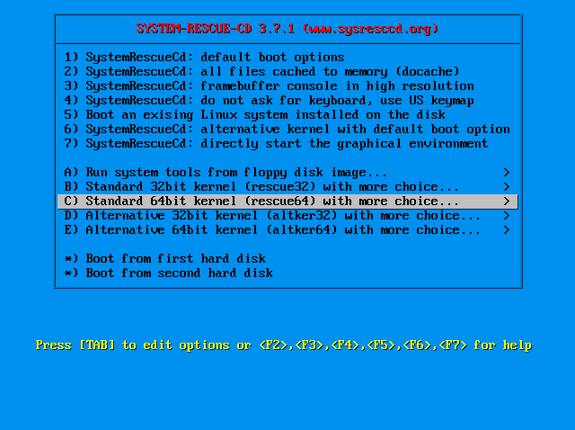
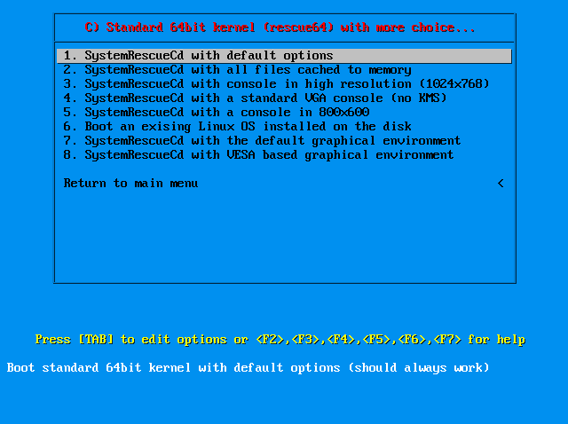
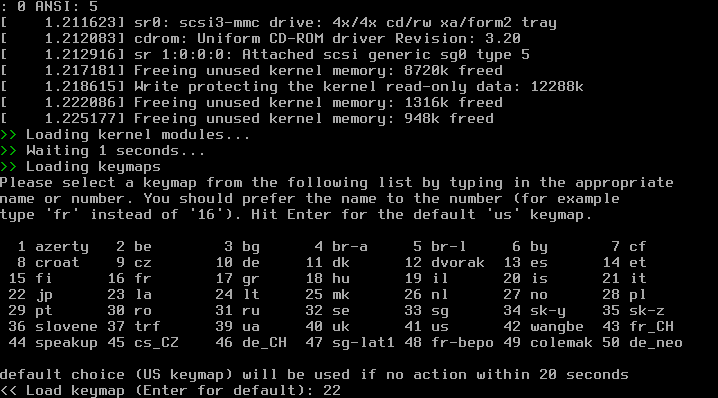
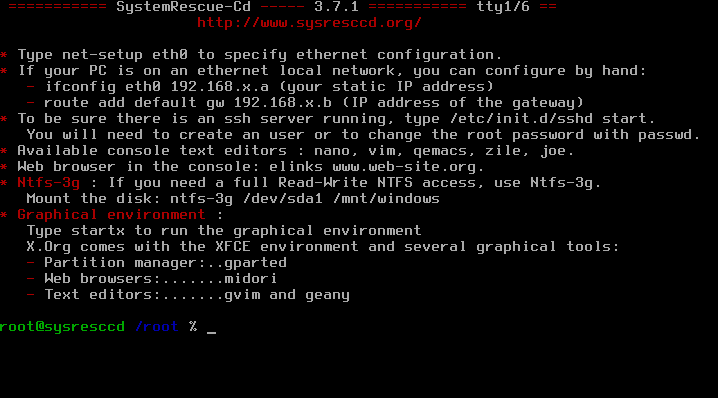

========================
インストールの準備をする
========================

インストールメディアは `SystemRescueCd <http://www.sysresccd.org/Download>`_ を使用する。

BIOSで該当のメディアがブートされるように設定し、インストールメディアをセットしブートする

   ブート後の選択画面 その1

   ブート後の選択画面 その2

   キーボードの選択

   対話シェルが起動した状態

下記コマンドでIPアドレスが割り当てられた事を確認する

::

   ifconfig -a

DHCPで割り当てず、固定IPアドレスを振る場合は下記コマンドを実施する ::

  % net-setup

リモートからsshで接続してインストール作業を実施する為、コンソールよりsshdの起動とrootパスワードの設定をする

::

   # passwd
   ※任意のパスワード aaa等を入力

::

   # /etc/init.d/sshd start
   # pgrep -l sshd ※起動確認

